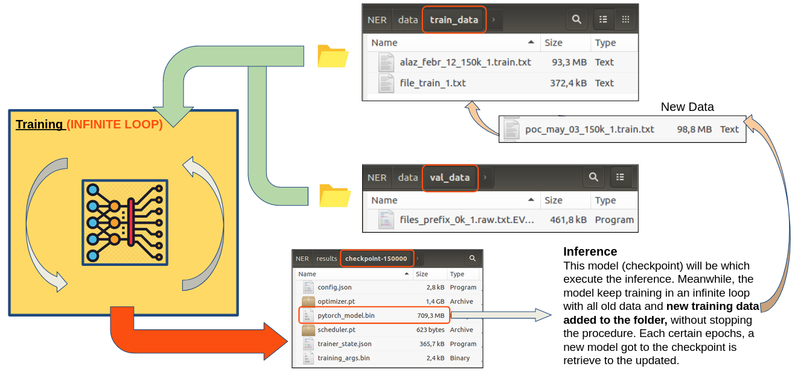

# Datio Model

## *Assumptions*

The aim of this solution is to replace an old model which had many problems in the accuracy and the integration

The aims of this solution are (*w.r.t Old Model*):
- Avoid RAM memory dependences.
- Get the serialization in ONNX.
- Migration to Python
- Improve the efficiency in the model replacing the Neural Network architecture.
- Fix several issues in the tokenization.

## Stages propused (training)

It is going to be mentioned each stage of the solution proposed in its corresponding execution order.

- **0/** Architecture.
- **1/** Training-validation data generation:
  - **1.1** Template generation.
  - **1.2** Get sample data.
- **2/** Preprocessing data:
  - **2.1** Determinate a main reference dataset with *base sentences*.
  - **2.2** Prepare and balance datasets.
- **3/** Training:

### **0/** Architecture

The proposed solution for the **NLP engine** is based on an **infinite loop**, or a **unbroken training**.

The model checks a "training folder", in which is continuously is receiving data, and adds those new data to the training batches. From this way, the model is balancing and updated with the newest and oldest data.

This approach would be near to be a *pseudo*-**Reinforcement Learning (RL)** because of the training would be continuous and unbroken.

### **1/** Training-Validation data generation
This task is on going. The template used is the same that the old approach (at the moment)

Get text data tagged is the first step to be able to train the model.

#### **1.1** Template generation
The main goal in this stage is avoid the **IOB file** and makes the most of the power of the Bert tokenizer.

It means, to turn into this format:

    Hola <CLIENT_NAME_FIRST>, me gustaria solicitar un cambio del PIN de mi tarjeta, el que me disteis es <CARD_PIN>, y quiero que sea <CARD_PIN>, puede ser? o lo tengo que cambiar yo?
    .
    .
    .
    Hola, me llamo <CLIENT_NAME_FIRST>, y mi dni <CLIENT_DNI>, he cambiado de coche, la matricula es <CAR_PLATE> y quiero asegurarlo, lo he comprado con mi tarjeta pero el pin no funciona, es <CARD_PIN>'
    
to this one:

    {
      "env_config": [],
      "expected_metrics": [],
      "dataset": [
        {
          "id": 0,
          "text": "Buenas noches Antelo, me gustaria solicitar un cambio del PIN de mi tarjeta, el que me disteis es 8018, y querria que sea 6040, puede ser? o lo tengo que cambiar yo? ",
          "expected_results": [
            {
              "value": "Antelo",
              "position": 14,
              "length": 6,
              "end": 19,
              "nlp_label": "CNM",
              "semantic_label": "NAME",
              "security_label": "NAME",
              "security_class": "PERSONAL_IDENTIFIER"
            },
            {
              "value": "8018",
              "position": 96,
              "length": 4,
              "end": 99,
              "nlp_label": "PIN",
              "semantic_label": "PIN_KEY",
              "security_label": "PIN_KEY",
              "security_class": "SECRETS_PERSONAL_KEYS"
            },
            {
              "value": "6040",
              "position": 120,
              "length": 4,
              "end": 123,
              "nlp_label": "PIN",
              "semantic_label": "PIN_KEY",
              "security_label": "PIN_KEY",
              "security_class": "SECRETS_PERSONAL_KEYS"
            }
          ]
        }, ...

#### **1.2** Get sample data 

Once, the template file is finished, this one will be the input of the text generation model. This model will create new text samples from the template.

*The text generation model is currently in development phase.*

This model is built from of **2 combinated NLP models (Summarization, Fill-Mask and Text Generation)**

This text generation model would create a dataset file ready to be fed by the NLP engine

### **2/** Preprocessing data
This task is on going. The preprocessing data has been adapted to the *IOB* file of the old approach (at the moment). 

#### **2.1** Determinate a main reference dataset with base sentences.
Before generating random text data for the training, it would be interesting to create a base dataset which contains several simple sentences in different ways for each tag, in order to set basic relationships and the model will progress from this point  

For example, from the different ways to express a DNI format (as is shown below), it would be created as many sentences, for each case, as is wanted. 
      
    {
       "templates":[
          {
             "label":"<CLIENT_DNI>",
             "nlp_label":"DNI",
             "templates":[
                ("<NUMBER_008><LETTER_001>", 3),
                ("<LETTER_001><NUMBER_008>", 2),
                ("<NUMBER_008> <LETTER_001>", 1),
                ("<NUMBER_008>-<LETTER_001>", 1),
                ("<LETTER_001>-<NUMBER_008>", 1),
                ("<NUMBER_002>.<NUMBER_003>.<NUMBER_003>.<LETTER_001>", 1),
                ("<NUMBER_002>.<NUMBER_003>.<NUMBER_003>-<LETTER_001>", 2),
                ("<NUMBER_002>-<NUMBER_003>-<NUMBER_003>-<LETTER_001>", 1),
                ("<NUMBER_002> <NUMBER_003> <NUMBER_003> <LETTER_001>", 1),
                ("<NUMBER_002>-<NUMBER_003>-<NUMBER_003> <LETTER_001>", 1),
                ("X-<NUMBER_008>", 1),
                ("X<NUMBER_008>", 1),
             ]
          },
          {
            "label":...
          }
    ...
    }

Then creating this basic dataset, it would be moving on to generate random sentences.

#### **2.2** Prepare and balance datasets.
Once, the basic dataset and more data is ready, a function would balance, at least, the tags with similar structure as could be the *Plate number (4575 KKJ)* and *PIN KEY number (4589)*

The function shows to the user the amount of different tags contained in the dataset, and it would try balancing them the best way possible.

The balancing of the dataset is optional, but is recommended to achieve a good model efficiency

### **3/** Training

This task is **COMPLETE**. *This was the main task to check if this approach is viable. Known the viability of this task, the rest of task take relevance.*

- Architecture

The model is built in **Python**, and based on **Transformers** (*Attention is all you need*)

This architecture provides more accuracy and is more efficient than the LSTMs (as is built the old model), in addition, is parallelizable.

- Avoid RAM memory dependences

One of task to carry out was, to avoid any RAM memory dependencies. For that, an **iterator** has been developed to feed to model incrementally without having to load all data in the RAM memory.

The libraries used to develop the model are:

- **python 3.9.4**
- **torch 1.8.1**
- **transformers 4.5.1** (Hugging face 🤗)
- **pandas 1.2.4**
- **numpy 1.20.1**

A custom library has been created to make easier the interaction to the user, and the code could be something like this:

    import ner_v2 as ner

    folder_train_path = './data/train_data'  # formato IOB
    folder_val_path = './data/val_data'  # formato JSON

    nlp = ner.NLP(path_folder_train=folder_train_path, path_folder_val=folder_val_path, gpu=True)

    nlp.train(epochs=2, 
          batch_size=2,
          evaluation=True,
          save_model=True,
          check_labels=False)

- Parameters to instance the NLP class
  - **path_folder_train:** [*string*] folder where the training data will be.
  - **path_folder_val:** [*string*] folder where the validation data will be.
  - **gpu:** [*boolean*] True if gpu is available.

- Parameters to train NER model:
  - **epochs:** [**int**] number of complete passes through the training dataset
  - **batch_size:** [*int*] number of training samples to work through before the model’s internal parameters are updated.
  - **save_model:** [*boolean*] True if the model is saved in disk.
  - **evaluation:** [*boolean*] True if the validation data is used to validate the model.
  - **check_labels:** [*boolean*] this parameter would apply if an isolated training is going to be made, instead of an unbroken training. This parameter checks the amount of diferent tags in the dataset, and it would be modified the last FC layer in the neural network according to this value.

In the training procedure, the model monitors and shows the updated of the following metrics:
  - progress percentage
  - time spent and time left
  - data processed by second
  - losses
  - learning rate updated (the model uses adaptive learning rate)
  - current epoch

In the case to train a small dataset, **501 samples with 9 tags (training with GPU)**, the monitoring would be the following:

It takes around 9 minutes, with a batch size of 2 samples (*due to memory dependencies*)

If the dataset is higher, **151.000 samples and 49 tags (training with GPU)**, the monitoring would be:

In this case, the training procedure takes 17 hours (the same batch size), however, the conclusion is that the model was able to be trained. If the batch size was greater, the time would plummet.

As it can be seen, the GPU works at 99%

Once the model has finished the training procedure, the model can be called, and the **Inference** is performed.

The code to do the **inference** procedure could be:

    import ner_v2 as ner

    nlp = ner.NLP(gpu=True)
    
    model_path = 'model/DATIO_NER_model'
    nlp.load_model(model_path)

    example = 'Hola, me llamo Julio, y mi dni es 8959217 G, he cambiado de coche, la matricula es 6168HLP y quiero asegurarlo, lo he comprado con mi tarjeta pero el pin no funciona, es 5895'

    pred = nlp.get_prediction(example)

the metrics obtained are: 

    eval_loss = 0.005
    eval_accuracy_score = 0.9808332678248565
    eval_precision = 0.972
    eval_recall = 0.884224
    eval_f1 = 0.8952
    eval_runtime = 21.6284
    eval_samples_per_second = 20.112
    epoch = 2.0
    eval_mem_cpu_alloc_delta = 41877504
    eval_mem_gpu_alloc_delta = 0
    eval_mem_cpu_peaked_delta = 41750528
    eval_mem_gpu_peaked_delta = 116025344

The output is:

As is shown, the NER model works.

Finally, let us export the model to **ONNX**

    from torch.onnx import export
    
    device = torch.device('cuda') if torch.cuda.is_available() else torch.device('cpu')    

    model_onnx_path = "model.onnx"
    dummy_input = (
        train_dataset[0]["input_ids"].unsqueeze(0).to(device), 
        train_dataset[0]["token_type_ids"].unsqueeze(0).to(device), 
        train_dataset[0]["attention_mask"].unsqueeze(0).to(device)
    )
    input_names = ["input_ids", "token_type_ids", "attention_mask"]
    output_names = ["logits"]
    export(
        model, dummy_input, model_onnx_path, input_names = input_names, 
        output_names = output_names, verbose=False, opset_version=11
    )

I leave important topics such as hyperparameter tuning, cross-validation, and more detailed model validation. These tasks are pending

